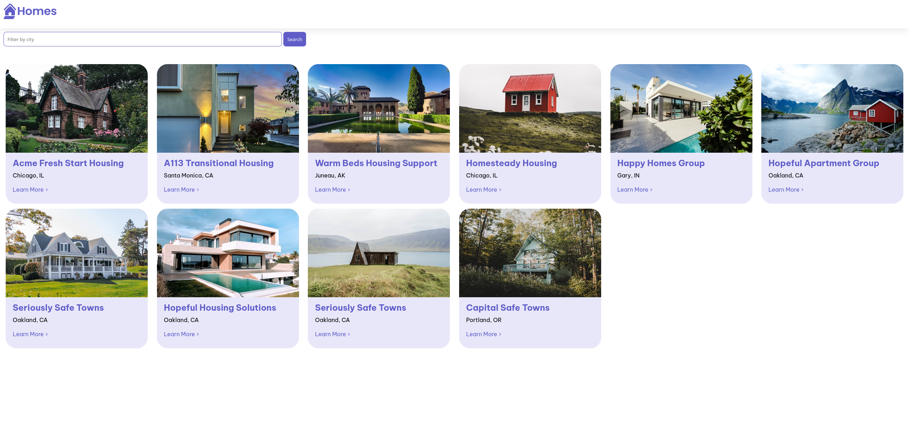
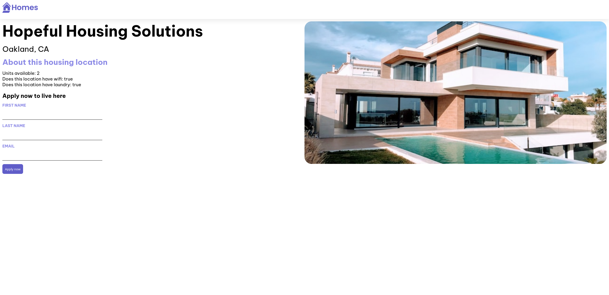

# Angular Javascript Framework: Angular Homes Tutorial Code

Following the tutorial at <https://angular.io/tutorial/first-app>

## Run it

```
$ cd tutorial-angular-homes
$ npm install
$ ng serve
$ json-server --watch db.json
```

In a web browser on your development computer, open <http://localhost:4200>.

The data is provided by the local webservice running under <http://localhost:3000/locations>.

## Screenshots

Homepage:



Details page:

